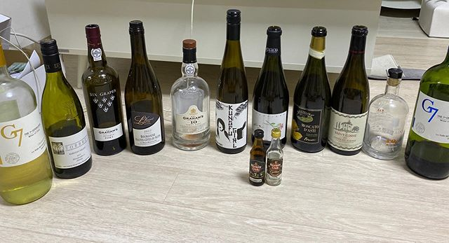

## 와인에 관심을 가지게 된 계기.

나는 원래는 와인을 좋아 하지 않았다. 기본적으로 위스키에 대한 허세(?)가 있었기 때문이다. 신혼 여행을 하면서 분위기에 취해 와인을 먹어보자며 포르투(porto)에서 포트와인을 먹었다. 처음 먹어보는 포트와인 매력에 빠져 포트와인 와이너리 투어도 신청을 했었다.

[그라함 와이너리](https://www.grahams-port.com/) 투어에서 영어 듣기 평가의 시간은 힘들었지만 마지막에 다양한 제품을 먹어보고 맛있어서 아직 신혼여행의 여정이 남아 있음에도 구매를 해서 여행기간에 힘들게 가지고 다녔다. 그 후 나는 와인에 푹 빠졌다.

2019 년 10 월부터 2019 년 12 월 31 일까지 먹은 와인 이다.

먹다보니 좀 더 와인을 알아야겠다고 생각을 해서 와인 유튜버들도 많이 찾아보고, 코스트코 와인, 와인앤모어, 앤드류 와인샵 등등에서 와인에 대한 정보를 얻었고 구매하여 마셔봤다. 물론 유명한 와인 만화 신의 물방울 만화도 다시 봤었고 와인으로 만들수 있는 상그리아도 만들어 먹었다가 실패를 맛 보기도 했다.

## 책을 읽다. 만화로 배우는 와인의 역사

그러던 와중에 만화로 배우는 와인의 역사 책을 알게 되었고 구매해서 읽게 되었다. 관심 있으면 네이버에서 검색하면 [만화로 배우는 와인의 역사](https://book.naver.com/bookdb/book_detail.nhn?bid=15874822) 를 찾아서 보면 잼있을것이다. 모 대충 내용은 고대부터 먹기 시작했고 가톨릭교회와 수도원을 통해 와인 양조 기법이 명맥을 이었고, 17 세기에 유리병이 발명되면서 와인 보존법이 혁명적으로 개선 되었고, 코르크 마개를 통해 더욱 보존법이.... 암튼 잼남..

앞으로 독서 관련 기록도 남기고 와인 마시고 나서 내 나름대로의 맛 표현을 기록에 남길까 한다.

맛있는 와인은 계속.. 비싼 와인은 못 사먹지만..ㅎㅎ 급 마무리..
