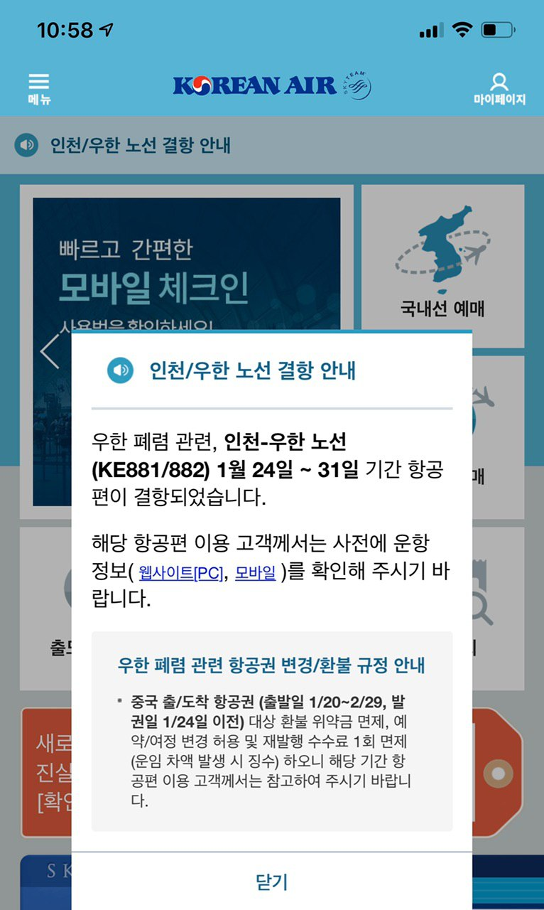
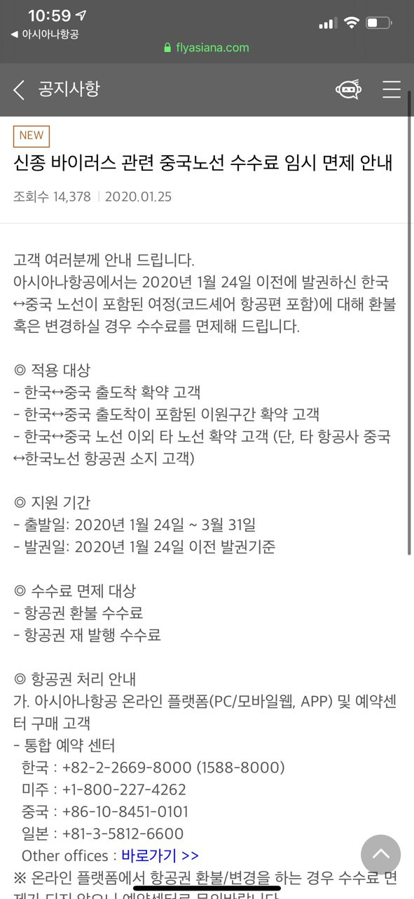

#우한 폐렴 비행기 환불 어떻게 되나? 대한항공과 아시아나 비교해보자

## 대한항공 모바일에서 안내되는 팝업

### [대한항공] 우한 폐렴 관련 항공권 변경/환불 규정 안내

중국 출/도착 항공권 (출발일 1/20~2/29, 발권일 1/24 일 이전) 대상 환불 위약금 면제, 예약/여정 변경 허용 및 재발행 수수료 1 회 면제 (운임 차액 발생 시 징수) 하오니 해당 기간 항공편 이용 고객께서는 참고하여 주시기 바랍니다.

### [아시아나] 신종 바이러스 관련 중국노선 수수료 임시 면제 안내

고객 여러분께 안내 드립니다.
아시아나항공에서는 2020 년 1 월 24 일 이전에 발권하신 한국 ↔ 중국 노선이 포함된 여정(코드셰어 항공편 포함)에 대해 환불 혹은 변경하실 경우 수수료를 면제해 드립니다.

◎ 적용 대상

- 한국 ↔ 중국 출도착 확약 고객
- 한국 ↔ 중국 출도착이 포함된 이원구간 확약 고객
- 한국 ↔ 중국 노선 이외 타 노선 확약 고객 (단, 타 항공사 중국 ↔ 한국노선 항공권 소지 고객)

◎ 지원 기간

- 출발일: 2020 년 1 월 24 일 ~ 3 월 31 일
- 발권일: 2020 년 1 월 24 일 이전 발권기준

◎ 수수료 면제 대상

- 항공권 환불 수수료
- 항공권 재 발행 수수료

◎ 항공권 처리 안내
가. 아시아나항공 온라인 플랫폼(PC/모바일웹, APP) 및 예약센터 구매 고객

- 통합 예약 센터

  한국 : +82-2-2669-8000 (1588-8000)

  미주 : +1-800-227-4262

  중국 : +86-10-8451-0101

  일본 : +81-3-5812-6600

  Other offices : [바로가기](https://flyasiana.com/C/KR/KO/contents/domestic-overseas-branches)>>

※ 온라인 플랫폼에서 항공권 환불/변경을 하는 경우 수수료 면제가 되지 않으니 예약센터로 문의바랍니다.

나. 그외(여행사, 대리점, 그외 예약사이트) 구매 고객

- 해당 구매처 변경/환불 취소 가능

◎ 주의 사항

- 여정 사전 취소 필수
- 항공권 유효기간 이내에 변경, 운임 및 세금 차액은 지불 조건
- 타 항공사 한국 ↔ 중국 노선 항공권 소지 시 증빙 제출 필수
- 홍콩, 대만 노선 제외

감사합니다.

라고 작성되어 있다.

## 환불 요약

### 대한항공, 아시아나항공 요약

- 공통점

  - 1/24 일 발권 이전 고객에 한해 환불 위약금 면제, 예약/여정 변경 허용 및 재발행 수수료 면제

- 차이점
  - 출발일
    - 대한항공 : 1/20~2/29
    - 아시아나 : 1/24~3/31
  - 환불 플랫폼
    - 대한항공 : 안내된 정보 없음
    - 아시아나 : 예약센터에서만 가능 (온라인 플랫폼에서 항공권 환불/변경을 하는 경우 수수료 면제가 되지 않으니 예약센터로 문의바랍니다.)
