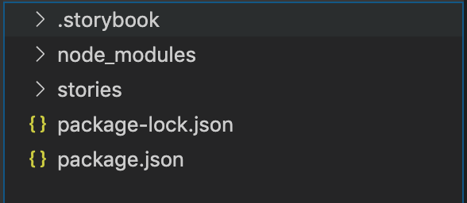
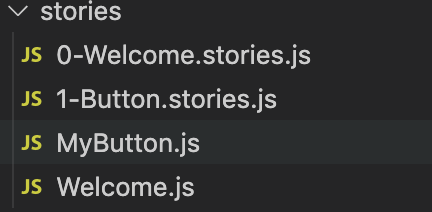
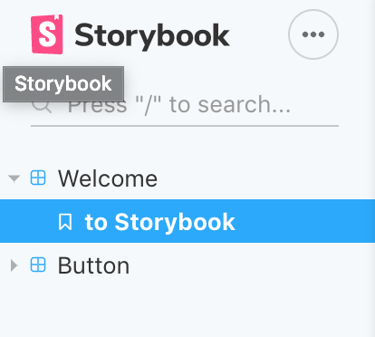

#Storybook Vue 폴더 구조 보기
[Storybook Vue 설치 (1)](/posts/Storybook-vue-step02)에서 문제 없이 설치가 됐다면 아래 이미지처럼 폴더가 구성이 되어 있을 것이다.


### .storybook 폴더(main.js)

```javascript
module.exports = {
  stories: ['../stories/**/*.stories.js'],
  addons: ['@storybook/addon-actions', '@storybook/addon-links'],
}
```

main.js 내용을 보자 stories Key 에는 ['../stories/**/*.stories.js'] stories.js 를 넣고 있고 addons Key 에는 에드온들을 넣고 있다.
그럼 stories.js 라는 확장자명을 가진 파일들을 활용한다고 볼수 있고 에드온도 main.js 에서 선언을 해야한다는걸 추측할수 있다.

### stories 폴더


어떻게 구성이 되어 있나를 분석하기 위해 0-Welcome.stories.js 와 Welcome.js 를 파일 내용을 비교해 봤다.

```javascript
//0-Welcome.stories.js 내용
import { linkTo } from '@storybook/addon-links'

import Welcome from './Welcome'

export default {
  title: 'Welcome',
  component: Welcome,
}

export const ToStorybook = () => ({
  components: { Welcome },
  template: '<welcome :showApp="action" />',
  methods: { action: linkTo('Button') },
})

ToStorybook.story = {
  name: 'to Storybook',
}
```

## 0-Welcome.stories.js 내용해석

첫줄은 @storybook/addon-links 로 스토리북내에 링크를 걸기 위해 불렀고 ToStorybook 함수내 methods 에 action 에 걸린걸 알수 있다.
Welcome 이라는 이름으로 ./Welcome 스크립트를 import 시켰다.
그리고 title 은 'Welcome' 이름으로 내보냈고 component 명은 Welcome 으로 내보냈다.

export const ToStorybook 에 내용은

컴포넌트는 Welcome 이고, template: 에는 <welcome 이름의 콤포넌트에 :showApp 에는 props 를 받았다.

액션에는 stroybook linkTo 를 'Button' (.stories.js 의 export default 에 title 에 따라간다)이동하게 할당했고 ToStorybook.story 의 name 은 to Storybook 이라고 명명하였는데 이것은 메뉴명 2depth 에 이름이다.



```javascript
// Welcome.js 내용
// eslint-disable-next-line no-console
const log = () => console.log('Welcome to storybook!')

export default {
  name: 'welcome',

  props: {
    showApp: {
      type: Function,
      default: log,
    },
  },

  data() {
    return {
      main: {
        padding: 15,
        lineHeight: 1.4,
        fontFamily:
          '"Helvetica Neue", Helvetica, "Segoe UI", Arial, freesans, sans-serif',
        backgroundColor: '#ffffff',
      },

      logo: {
        width: 200,
      },

      link: {
        color: '#1474f3',
        textDecoration: 'none',
        borderBottom: '1px solid #1474f3',
        paddingBottom: 2,
      },

      code: {
        fontSize: 15,
        fontWeight: 600,
        padding: '2px 5px',
        border: '1px solid #eae9e9',
        borderRadius: 4,
        backgroundColor: '#f3f2f2',
        color: '#3a3a3a',
      },

      note: {
        opacity: 0.5,
      },
    }
  },

  template: `
    <div :style="main">
      <h1>Welcome to STORYBOOK</h1>
      <p>
        This is a UI component dev environment for your app.
      </p>
      <p>
        We've added some basic stories inside the
        <br />
        <code :style="code">src/stories</code>
        <br />
        directory.
        <br />
        A story is a single state of one or more UI components. You can have as many stories as
        you want.
        <br />
        (Basically a story is like a visual test case.)
      </p>
      <p>
        See these sample
        <br />
        <a :style="link" @click="onClick" role="button" tabIndex="0">stories</a>
        <br />
        for a component called
        <br />
        <code :style="code">Button</code>
        .
      </p>
      <p>
        Just like that, you can add your own components as stories.
        <br />
        You can also edit those components and see changes right away.
        <br />
        (Try editing the <code :style="code">Button</code> component
        located at <code :style="code">src/stories/Button.js</code>.)
      </p>
      <p>
        This is just one thing you can do with Storybook.
        <br />
        Have a look at the
        <br />
        <a
          :style="link"
          href="https://github.com/storybookjs/storybook"
          target="_blank"
          rel="noopener noreferrer"
        >
          Storybook
        </a>
        <br />
        repo for more information.
      </p>
      <p :style="note">
        <b>NOTE:</b>
        <br />
        Have a look at the
        <br />
        <code :style="code">.storybook/webpack.config.js</code>
        <br />
        to add webpack
        loaders and plugins you are using in this project.
      </p>
    </div>
  `,

  methods: {
    onClick(event) {
      event.preventDefault()
      this.showApp()
    },
  },
}
```

### Welcome.js 내용해석

Props 의 showApp 에는 타입과 디폴트에 로그가 찍히게 해놨다. [vue-props 설명](https://kr.vuejs.org/v2/guide/components-props.html)에서 보면 된다.

data 에는 스타일을 적용하기위해 넣었는데 logo 는 없는데 아마도 리액트에는 있지 않을까 한다.

그리고 methods 에는 onClick 이벤트 함수명을 넣었고

@click="onClick" 를 찾아보면 this.showApp() 이라는걸 실행하게 했는데 이건 0-Welcome.stories.js 에 { action: linkTo('Button') } 과 props 로 연결이 된다

#### 요약

스토리북은 참 가이드가.... 불친절한거 같다. 아니면 내가 실력이 부족해서 그런거 일지도..
