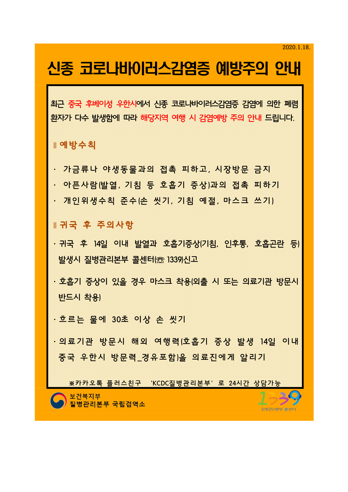
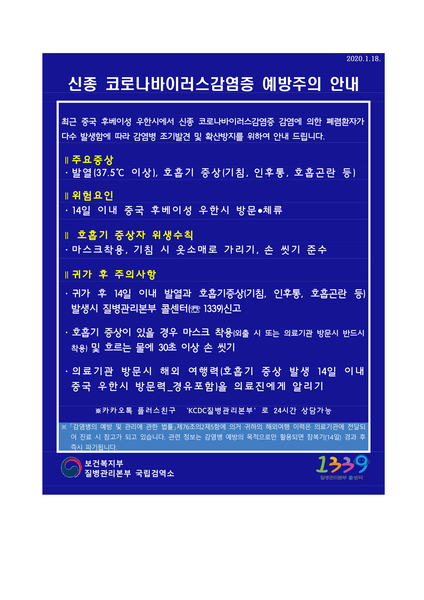

## 존스홉킨스 대학에서 만든 코로나 바이러스 맵(Wuhan Coronavirus (2019-nCoV) Global Cases (by JHU CSSE))

[우한폐렴 맵](https://gisanddata.maps.arcgis.com/apps/opsdashboard/index.html?fbclid=IwAR3eKUPo-GlJCspMkKxWZ6p0pfuw2rJgUTCThvoF4rK4vYc3JchAnwb7U8Q#/bda7594740fd40299423467b48e9ecf6)

## 우한폐렴 확진자 기준 (2020-01-27 00:41:11)

확진자 2019 명 이네요. 너무 많네요.

### 세계 각국 Coronavirus outbreak

[cnn](https://edition.cnn.com/asia/live-news/coronavirus-outbreak-hnk-intl-01-26-20/index.html)
[nytimes](https://www.nytimes.com/2020/01/26/world/china-coronavirus.html?action=click&module=Top%20Stories&pgtype=Homepage)
[BBC](https://www.bbc.com/news/topics/cyz0z8w0ydwt/coronavirus-outbreak)

### 우리나라 관련 소식

[해외감염병 NOW - 신종코로나바이러스 현황](http://www.xn--now-po7lf48dlsm0ya109f.kr/infect/occurrence_list.do)

#### 중국 우한시 출국자용 안내문(한)

[중국 우한시 출국자용 안내문](http://www.xn--now-po7lf48dlsm0ya109f.kr/contents/info.do?contents_no=co_202001200002&type=&pageIndex=&category_no=&contents_nm=)

원래 주소 : http://www.해외감염병now.kr/upload/contents/img/c2ee37970cb64be4bcc923845f4d7663.png

#### 우한시 입국자용(한글)

[우한시 입국자용](http://www.xn--now-po7lf48dlsm0ya109f.kr/contents/info.do?contents_no=co_202001200001&type=&pageIndex=&category_no=&contents_nm=)

원래 주소 : http://www.해외감염병now.kr/upload/contents/img/56b6579927ce458683e75414ebeb2ab1.png
