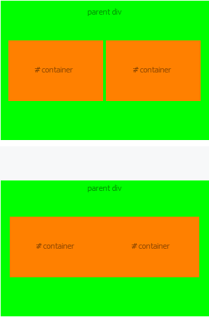

## inline-block div 간격 없애기

inline-block 연속으로 있으면 이렇게 약간의 4px정도가 생긴다. 이걸 해결하는 방법은 몇가지 방법이 있다.

## 현상



## 방법

1. 마크업으로 처리

```html
<div>abcdabcdef</div>
<!--
-->
<div>abcdabcdef</div>
<!--
-->
<div>abcdabcdef</div>
<!--
-->
<div>abcdabcdef</div>
<!--
-->
<div>abcdabcdef</div>
<!--
-->
<div>abcdabcdef</div>
```

2. 마크업으로 처리

```html
<div>abcdabcdef</div>
<div>abcdabcdef</div>
<div>abcdabcdef</div>
<div>abcdabcdef</div>
<div>abcdabcdef</div>
```

3. 마크업으로 처리

```html
<div>abcdabcdef</div>
<div>abcdabcdef</div>
<div>abcdabcdef</div>
<div>abcdabcdef</div>
<div>abcdabcdef</div>
```

4. 마크업으로 처리

```html
<div>abcdabcdef</div>
<div>abcdabcdef</div>
<div>abcdabcdef</div>
<div>abcdabcdef</div>
<div>abcdabcdef</div>
```

5. CSS로 처리

```css
#parent {
  font-size: 0;
}
#child {
  font-size: 16px;
}
```

6. CSS로 처리

```css
#parent {
  display: flex;
}
#child {
  display: inline-block;
}
```
