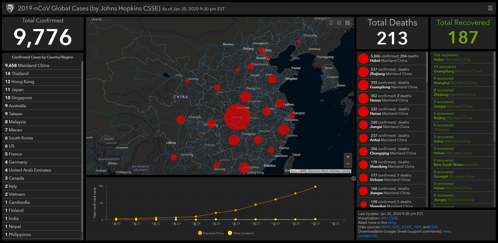

## WHO 비상사태를 선언

아침에 급상승 검색어로 WHO 비상사태가 검색어 1위이다.
[검색어 결과](https://search.naver.com/search.naver?where=nexearch&query=who%20%EB%B9%84%EC%83%81%EC%82%AC%ED%83%9C&sm=top_lve.agallgrpmamsi0en0sp0&ie=utf8)

> 현지시간 30일 오후 스위스 제네바에서 긴급회의를 소집한 세계보건기구, WHO는 신종 코로나바이러스 감염증 확산에 대해 국제비상사태를 선포했습니다.
> WHO에서 비상상태가 선언되는 경우는 '국제공중보건 위기상황'으로 불리는 비상사태는 질병이 국제적으로 펴져 다른 나라의 공중 보건에 위험이 되는 경우에 선포된다고 합니다.
> 국제비상사태가 선포되면 일단 발원지인 중국과 감염이 확산되는 지역에 대한 체계적인 조사가 이뤄지고 특히 여행 등 나라 간 이동이 제한될 수 있지만, WHO는 이번에 교역과 이동을 제한하는 것을 권고하지는 않는다고 밝혔습니다.
> [기사 출처](https://imnews.imbc.com/replay/2020/nwtoday/article/5655840_32531.html)

## 존스홉킨스 대학에서 만든 코로나 바이러스 맵 안들어가짐.

[우한폐렴 맵](https://gisanddata.maps.arcgis.com/apps/opsdashboard/index.html?fbclid=IwAR3eKUPo-GlJCspMkKxWZ6p0pfuw2rJgUTCThvoF4rK4vYc3JchAnwb7U8Q#/bda7594740fd40299423467b48e9ecf6)

## 고민중

4월달 태국 여행이 계획되어 있는데... 아... 취소를 해야하나 말아야하나.
