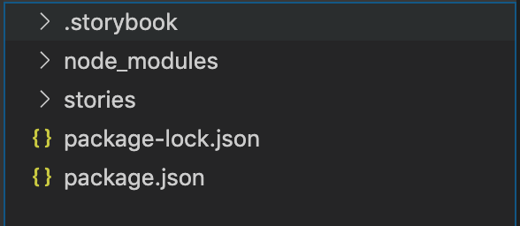

## storybook + vue 이것저것 해보기

저번 블로그 글에서는 설치해보고 이것저것 만져 가면서 요소요소들이 어떻게 작동하는지 대충 파악 했다면 이번에는 누군가 훌륭하게 튜토리얼을 만들었을거라 생각해서
검색해 했다.

### Button 컴포넌트 만들어보기

1. Storybook 폴더정리
   기존 스토리북 폴더구조
   
   변경 스토리북 폴더구조
   

```bash
/src/components/  // components 넣을 폴더
/src/stories/     // stories 넣을 폴더

```

그리고 ./storybook/main.js 수정

```javascirpt
module.exports = {
  stories: ["../src/stories/**/*.stories.js"],
  addons: ["@storybook/addon-actions", "@storybook/addon-links"]
};

```

2. Button.vue 컴포넌트 작성

```vue
<template>
  <button class="button" :class="`${classed}`">
    <slot></slot>
  </button>
</template>

<script>
export default {
  name: 'Button',
  props: {
    classed: {
      type: String,
      default: 'normal', // 'normal' or 'primary'
    },
  },
}
</script>
<style scoped>
.button {
  appearance: none;
  border: none;
  font-family: sans-serif;
  padding: 8px 16px;
  border-radius: 2px;
}

.button.normal {
  background-color: #eee;
  color: #222;
}

.button.normal:hover,
.button.normal:focus {
  background-color: #e0e0e0;
}

.button.normal:active {
  background-color: #bdbdbd;
}

.button.primary {
  background-color: #2196f3;
  color: #fff;
}

.button.primary:hover,
.button.primary:focus {
  background-color: #1e88e5;
}

.button.primary:active {
  background-color: #1976d2;
}
</style>
```

3. Button.stories.js 작성

```javascript
import Button from '../components/Button'

export default {
  title: 'Button',
}

export const normalButton = () => ({
  components: { Button },
  template: '<Button>Normal Button</Button>',
})

export const primaryButton = () => ({
  components: { Button },
  template: '<Button classed="primary">Normal Button</Button>',
})
```

4. storybook 화면
   
