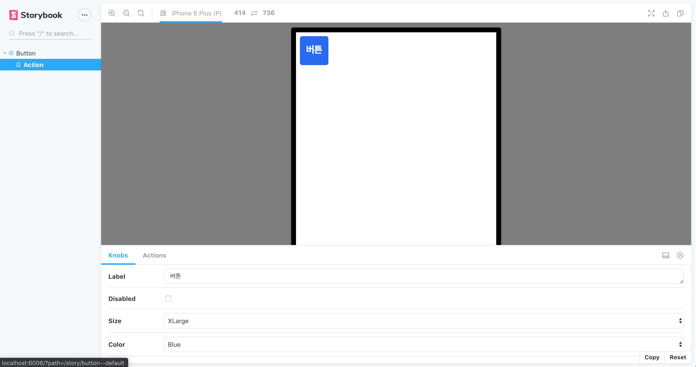

## Storybook Addon Vue Example

이 페이지에서는 3가지 storybook Add-on 설치를 위한 기록이다.

1. Storybook Knobs [링크](https://github.com/storybookjs/storybook/tree/master/addons/knobs)

2. Storybook Actions [관련링크](https://github.com/storybookjs/storybook/tree/master/addons/actions)

3. Storybook Viewport[관련링크](https://github.com/storybookjs/storybook/tree/master/addons/viewport)

### .storybook/main.js

@storybook/addon-actions, @storybook/addon-knobs, @storybook/addon-actions/register, @storybook/addon-viewport/register 추가한다.

```javascript
module.exports = {
  stories: ['../src/stories/**/*.stories.js'],
  addons: [
    '@storybook/addon-actions',
    '@storybook/addon-links',
    '@storybook/addon-knobs',
    '@storybook/addon-actions/register',
    '@storybook/addon-viewport/register',
  ],
}
```

###

#### Storybook Knobs

**Button.stories.js**

```javascript
import { withKnobs, text, select, boolean } from '@storybook/addon-knobs'

import Button from './Button'

export default {
  title: 'Button',
  component: Button,
  decorators: [withKnobs],
}

export const Default = () => ({
  components: { Button },
  parameter: {
    component: Button,
  },
  template:
    '<Button :size="size" :color="color" :disabled="disabled">{{text}}</Button>',
  props: {
    text: {
      default: text('Label', '버튼'),
    },
    disabled: {
      default: boolean('Disabled', false),
    },
    size: {
      default: select(
        'Size',
        {
          XLarge: 'XL',
          Large: 'L',
          Medium: 'M',
          Small: 'S',
          XSmall: 'XS',
        },
        'M'
      ),
    },
    color: {
      default: select(
        'Color',
        {
          Grey: '',
          Black: 'Black',
          White: 'White',
          Blue: 'Blue',
          Red: 'Red',
        },
        'grey'
      ),
    },
  },
})
```

**Button.vue**

```vue
<template>
  <button
    type="button"
    :class="['btnSize' + size, 'color' + color]"
    :disabled="disabled || false"
  >
    <slot />
  </button>
</template>

<script>
export default {
  name: 'Button',
  props: {
    size: {
      type: String,
    },
    color: {
      type: String,
    },
    disabled: {
      type: Boolean,
      default: false,
    },
  },
}
</script>
```

##### 보충설명

select(title,options,defaultValue) - [관련링크](https://github.com/storybookjs/storybook/tree/master/addons/knobs#select)

```javascript
size: {
  default: select(
    "Size",
    {
      XLarge: "XL",
      Large: "L",
      Medium: "M",
      Small: "S",
      XSmall: "XS"
    },
    "M"
  )
},
```

#### Storybook Actions

.vue 파일에서 emit으로 상위로 전파후 .stories.js 에서 method에서 action 찍는다.

**Button.stories.js**

```javascript
import { action } from '@storybook/addon-actions'
import { withKnobs, text, select, boolean } from '@storybook/addon-knobs'

import Button from '../components/Button'
import '../../public/css/pattern.css'

export default {
  title: 'Button',
  component: Button,
  decorators: [withKnobs],
}

export const Default = () => ({
  components: { Button },
  parameter: {
    component: Button,
  },
  template:
    '<Button :size="size" :color="color" :disabled="disabled" @click="log">{{label}}</Button>',
  props: {
    label: {
      default: text('Label', '버튼'),
    },
    disabled: {
      default: boolean('Disabled', false),
    },
    size: {
      default: select(
        'Size',
        {
          XLarge: 'XL',
          Large: 'L',
          Medium: 'M',
          Small: 'S',
          XSmall: 'XS',
        },
        'M'
      ),
    },
    color: {
      default: select(
        'Color',
        {
          Grey: '',
          Black: 'Black',
          White: 'White',
          Blue: 'Blue',
          Red: 'Red',
        },
        'grey'
      ),
    },
  },
  methods: {
    log: action('log'),
  },
})
Default.story = {
  name: 'Action',
  parameters: {
    viewport: { viewports: newViewports, defaultViewport: 'iphone5' },
  },
}
```

**Button.vue**

```vue
<template>
  <button
    type="button"
    :class="['btnSize' + size, 'color' + color]"
    :disabled="disabled || false"
    @click="onClick"
  >
    <slot />
  </button>
</template>

<script>
export default {
  name: 'Button',
  props: {
    size: {
      type: String,
    },
    color: {
      type: String,
    },
    disabled: {
      type: Boolean,
      default: false,
    },
  },
  methods: {
    onClick($event) {
      /**
       * Emitted when the button is clicked.
       * @event click
       * @type {Event}
       */
      this.$emit('click', $event)
    },
  },
}
</script>
```

#### Storybook Viewport

```javascript
import { action } from '@storybook/addon-actions'
import { withKnobs, text, select, boolean } from '@storybook/addon-knobs'

import Button from '../components/Button'
import '../../public/css/pattern.css'

const newViewports = {
  iphone5: {
    name: 'iPhone 5',
    styles: {
      height: '568px',
      width: '320px',
    },
    type: 'mobile',
  },
  iphone6: {
    name: 'iPhone 6',
    styles: {
      height: '667px',
      width: '375px',
    },
    type: 'mobile',
  },
  iphone6p: {
    name: 'iPhone 6 Plus',
    styles: {
      height: '736px',
      width: '414px',
    },
    type: 'mobile',
  },
  iphone8p: {
    name: 'iPhone 8 Plus',
    styles: {
      height: '736px',
      width: '414px',
    },
    type: 'mobile',
  },
  iphonex: {
    name: 'iPhone X',
    styles: {
      height: '812px',
      width: '375px',
    },
    type: 'mobile',
  },
  iphonexr: {
    name: 'iPhone XR',
    styles: {
      height: '896px',
      width: '414px',
    },
    type: 'mobile',
  },
  iphonexsmax: {
    name: 'iPhone XS Max',
    styles: {
      height: '896px',
      width: '414px',
    },
    type: 'mobile',
  },
  ipad: {
    name: 'iPad',
    styles: {
      height: '1024px',
      width: '768px',
    },
    type: 'tablet',
  },
  ipad10p: {
    name: 'iPad Pro 10.5-in',
    styles: {
      height: '1112px',
      width: '834px',
    },
    type: 'tablet',
  },
  ipad12p: {
    name: 'iPad Pro 12.9-in',
    styles: {
      height: '1366px',
      width: '1024px',
    },
    type: 'tablet',
  },
  galaxys5: {
    name: 'Galaxy S5',
    styles: {
      height: '640px',
      width: '360px',
    },
    type: 'mobile',
  },
  galaxys9: {
    name: 'Galaxy S9',
    styles: {
      height: '1480px',
      width: '720px',
    },
    type: 'mobile',
  },
  nexus5x: {
    name: 'Nexus 5X',
    styles: {
      height: '660px',
      width: '412px',
    },
    type: 'mobile',
  },
  nexus6p: {
    name: 'Nexus 6P',
    styles: {
      height: '732px',
      width: '412px',
    },
    type: 'mobile',
  },
  pixel: {
    name: 'Pixel',
    styles: {
      height: '960px',
      width: '540px',
    },
    type: 'mobile',
  },
  pixelxl: {
    name: 'Pixel XL',
    styles: {
      height: '1280px',
      width: '720px',
    },
    type: 'mobile',
  },
}

export default {
  title: 'Button',
  component: Button,
  decorators: [withKnobs],
  parameters: {
    viewport: { defaultViewport: 'iphone6' },
  },
}

export const Default = () => ({
  components: { Button },
  parameter: {
    component: Button,
  },
  template:
    '<Button :size="size" :color="color" :disabled="disabled" @click="log">{{label}}</Button>',
  props: {
    label: {
      default: text('Label', '버튼'),
    },
    disabled: {
      default: boolean('Disabled', false),
    },
    size: {
      default: select(
        'Size',
        {
          XLarge: 'XL',
          Large: 'L',
          Medium: 'M',
          Small: 'S',
          XSmall: 'XS',
        },
        'M'
      ),
    },
    color: {
      default: select(
        'Color',
        {
          Grey: '',
          Black: 'Black',
          White: 'White',
          Blue: 'Blue',
          Red: 'Red',
        },
        'grey'
      ),
    },
  },
  methods: {
    log: action('log'),
  },
})
Default.story = {
  name: 'Action',
  parameters: {
    viewport: { viewports: newViewports, defaultViewport: 'iphone5' },
  },
}
```

관련 링크 문서에는 vue에 관련된 내용은 거의 없어서 이것저것 찾아보면서 추가하여 설치하였다.

위에 나온 소스를 다 적용하면 이런 화면을 볼수 있을것이다.


