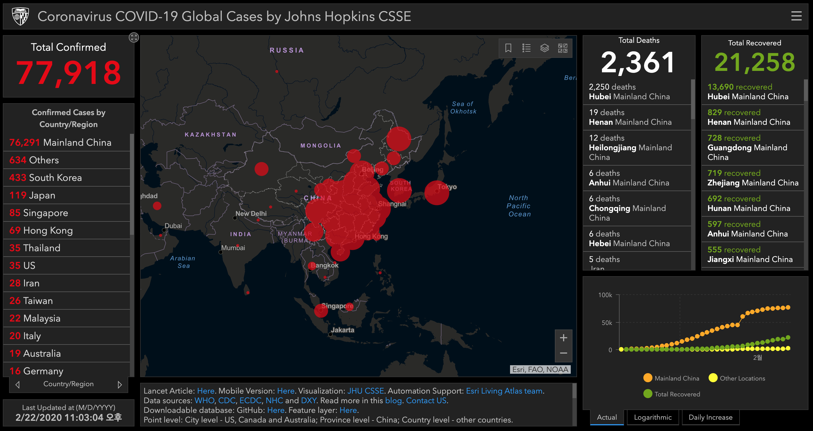
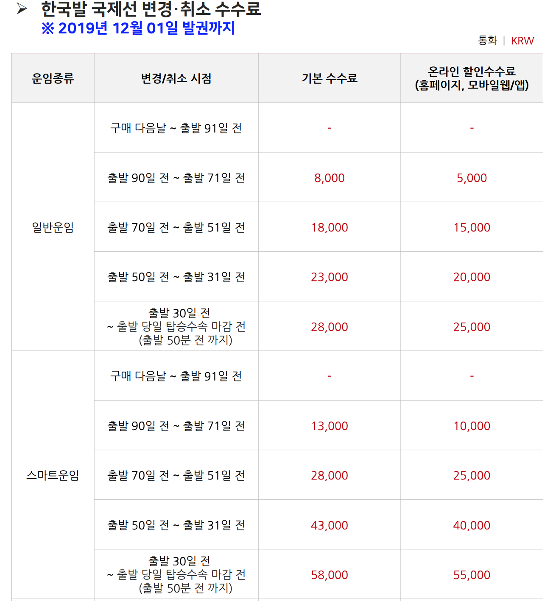
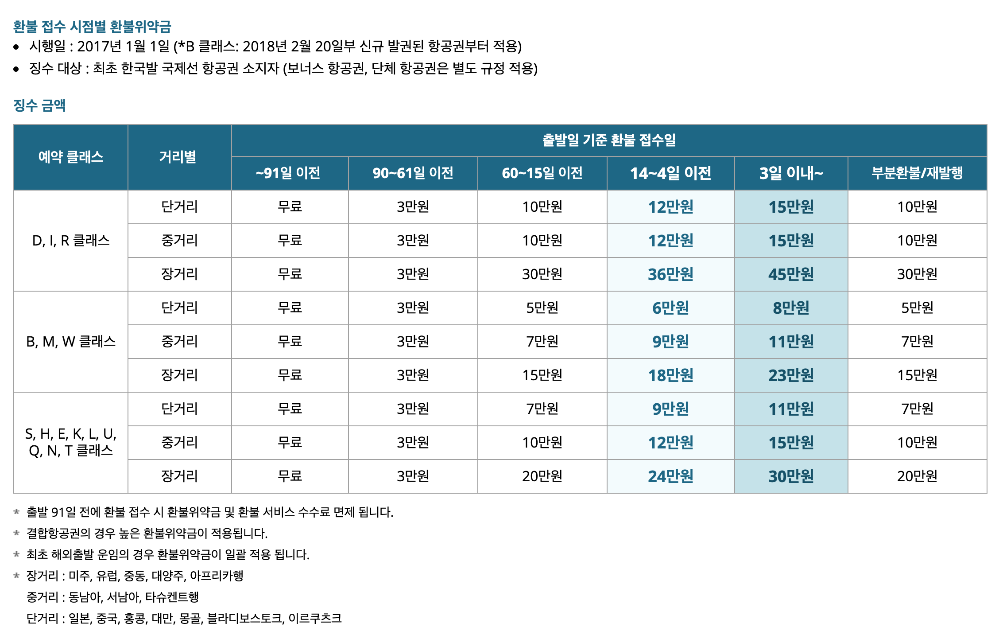

## 코로나19가 나에게 미치는 영향.

새해 계획이 틀어졌다. 우리 부부의 해외 여행은 4월달,7월,9달에 계획이 되어 있었다.
이중 4월달 7월달이 취소가 되버렸다.

- 인천 => 방콕 (4월)
- 방콕 => 인천 => 대만 (4월 귀국, 7월 출발)
- 대만 => 인천 (7월)

총 3편의 항공을 취소를 했다. 취소를 하게 된 이유는 코로나-19 때문이다.

태국도 위험하고 우리나라 위험하다 이러면 해외여행을 가는것도 위험하고 다녀와도 주변사람한테도 피해를 입힐수 있다. 여행을 가고 싶어 혹시나 본의 아니게 다른 사람들한테 피해를 준다면 이 또한 얼마나 안타까운 일인가 그래서 포기했다.

나는 항공권만 예약을 했기에 취소 수수료 또한 저렇게만 나왔을텐데 다른 분들은 호텔까지 예약했다면 더 많은 수수료를 ...... 다행이다.

## 추후 여행 계획.

일단 4월 7월달은 코로나19 때문에 힘들다고 판단 9월달은 아이슬란드이기에 문제가 없다고 판단. 그럼 중간에 여행지를 선택해야하는데 과연.....한국도 다 위험하고 어디를 갈수 있을지는 모르겠다. 조속히 코로나19가 더이상 확산이 안되길 바란다.

아....... 여행 갈 곳이 없다.

### 취소 수수료

취소 수수료는 항공사 마다 다른데 정리 해볼려고 한다.
TWAY [취소수수료](https://www.twayair.com/app/serviceInfo/feeInfo#none)

대한항공 [취소수수료](https://www.koreanair.com/content/koreanair/korea/ko/ticket-information/ticket-services/refund-penalty.html)

### 추가 정보들 (2020-02-23 14:12:57)

이제 역으로 한국으로의 여행 제한이 시작되고 있음. ㅠㅠ

방콕 한국간 일부항공편 취소 - airasia
[Travel Advisory: Thai AirAsia X Cancels Some Flights to and from South Korea due to the impact from the public health situation](https://newsroom.airasia.com/news/2020/2/20/travel-advisory-thai-airasia-x-cancels-some-flights-to-and-from-south-korea-due-to-the-impact-from-the-public-health-situation)

#### 코로나19 관련 앱들

- 코로나맵 [http://coronamap.site/](http://coronamap.site/)
- 코로나알리미 [https://corona-nearby.com/](https://corona-nearby.com/)
- 코로나있다 [https://www.coronaita.com/](https://www.coronaita.com/)
- 코로나나우 [https://coronanow.kr/](https://coronanow.kr/)
