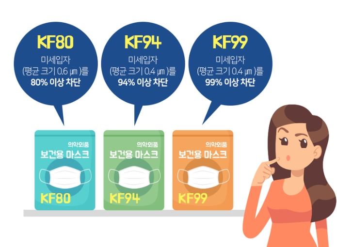

## KN95,KF94,N95 마스크 차이

일단 국내법상 보건용 마스크는 KF80, KF94, KF99 세 가지 등급이 있다.

> 이 중 KF80은 황사용, KF94, KF99는 방역용으로 분류된다. KF80 인증은 평균 0.6μm 크기의 입자를 80% 이상 차단할 수 있는 마스크에 주어진다. KF94 인증은 평균 0.4μm 크기의 입자를 94% 이상, KF99 인증은 평균 0.4μm 크기의 입자를 99% 이상 걸러낼 수 있는 마스크에 주어진다. by wiki

## KF 약자 뜻은?

KF(Korea Filter) 등급은 한국 식품의약안전처가 인증한 등급입니다. 마스크의 누설률(마스크와 얼굴 틈으로 미세먼지가 새는 비율), 분진포집효율(마스크가 먼지를 걸러내는 비율), 흡기 저항(숨쉬기 어려운 정도) 등 세 가지를 시험해 합격한 제품에만 KF 마크를 붙일 수 있지요. 등급 뒤의 숫자가 같으면 사실상 N 등급과 같은 성능의 마스크라고 봐도 무방합니다. 숫자가 높아질수록 더 촘촘하게 미세먼지를 막아준답니다.

출처: https://blog.kepco.co.kr/1209 [한국전력 블로그 굿모닝 KEPCO!]

## KN 약자 뜻은?

KN은 중국 인증 기준의 뜻으로
KN과 KP는 중국에서 인증한 마스크 제품이다. K 다음 붙는 P와 N은 해당 마스크가 분진, 오일 미스트를 보호할 능력을 보유하고 있는지에 대한 것으로 KP가 분진 및 장시간 오일 미스트 보호 능력이 있고, KN은 분진 보호는 되지만 오일 미스트 보호능력이 없다는 의미다. KF 등급과 유사하게 KN(P)95는 0.075㎛ 이상의 미세먼지를 95% 이상 차단하고 KN(P)100은 99.97% 이상 차단한다.

출처: https://www.mk.co.kr/news/it/view/2020/03/247404/

## N95의 N 뜻은?

N 등급은 미국 산업안전보건연구원(NIOSH)에서 제정한 마스크 등급입니다. N 뒤의 % 숫자만큼 공기 중에 떠다니는 미세먼지를 걸러 준다는 뜻이지요. 예를 들어 N 95 등급 마스크는 공기 중에 떠다니는 미세 과립을 95%의 확률로 막을 수 있습니다.

출처: https://blog.kepco.co.kr/1209 [한국전력 블로그 굿모닝 KEPCO!]

## 그외 등급

FFP는 유럽의 등급입니다
FFP1이 독성이 없고 비섬유형인 0.6 μm 크기의 입자의 최소 80%를 여과하여 KF80수준의 등급입니다.
FFP2가 유해하고 섬유형인 0.6 μm 크기의 입자의 최소 94%를 여과하여 KF94수준의 등급입니다.
FFP3가 유독성의 먼지, 연기, 에어로졸 형태의 입자의 최소 99%를 여과할수 있다고 하며, 방사능입자도 여과가 가능하다고 합니다.

출처: https://crossonesfinger.tistory.com/4
