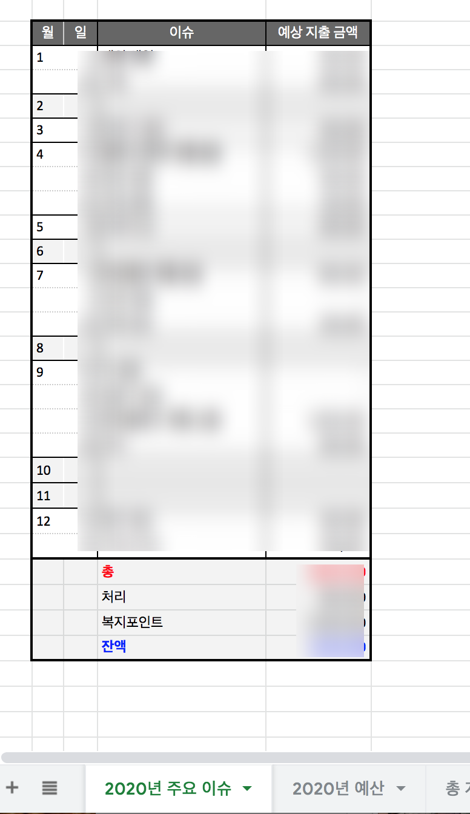
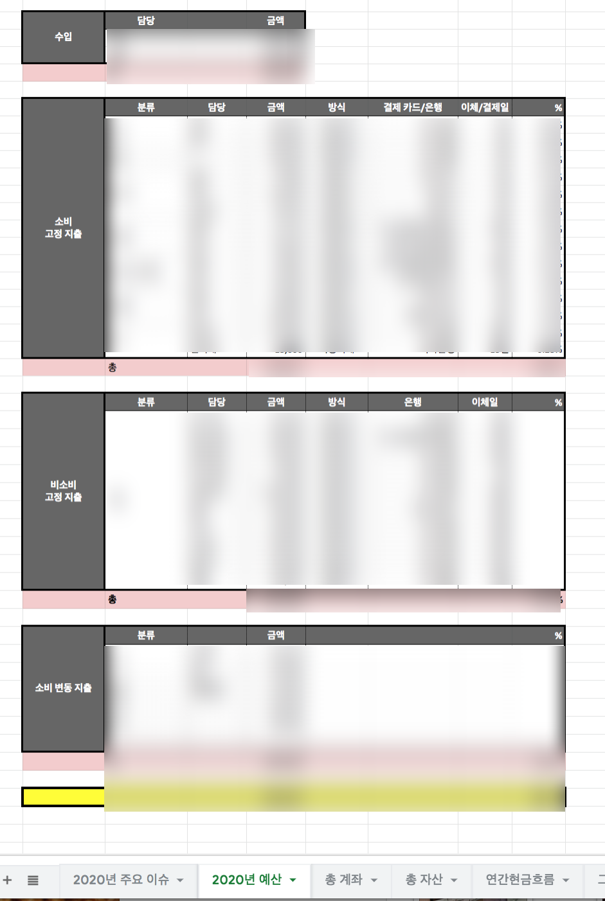
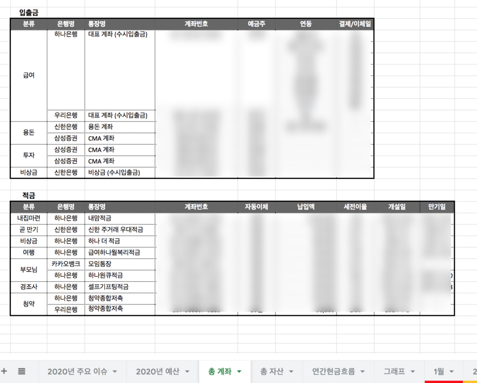

## 2020 우리만의 가계부를 작성 해보자.

드디어 2020년 1월이 끝났다.

1월이 끝남과 동시에 1월 가계부도 완성!

가계부를 쓰면서 우리 가정에 필요한 자산관리 형식을 파악해가며... 삭제와 추가를 반복했다.

다른 사람들 가계부도 많이 참고하고, 책도 보고....

나에게 2020년 1월은 가계부의 달이 아니었나싶은....ㅋㅋㅋㅋㅋㅋㅋㅋㅋㅋ

어쨌든, 자금흐름표와 예산을 토대로 우리 가정의 가계부 (a.k.a. 자산 현황표)는 이렇게 정리되었다.

언제나 그랬듯 남편과 공유하는 구글 시트를 만든다.

그리고 18개의 탭을 생성한다.

​

1. 2020년 주요 이슈

2020년에 발생하는 주요 이슈 목록 (양가 부모님 생신, 기념일, 어버이날 등. 목돈이 들어가는 항목을 나열하여 필요한 예산을 미리 가늠해본다)

2. 2020년 예산

주요 이슈와 우리 가정의 소비를 토대로 예산을 책정한다.

3. 총 계좌

우리가 가진 모든 은행 계좌를 쓴다. 그 계좌의 만기일, 금리등의 정보를 정리하고 해당 계좌와 연결된 카드, 적금, 공과금등을 매칭한다.

4. 총 자산

말 그대로 총 자산. 총 계좌에 들어있는 적금, 예금,비상금을 모두 쓴다.

5. 연간 현금흐름표

1~12월 가계부를 쓰면서 채워지는 항목들

6. 1~12월 월간 가계부

상세 지출 기록

7. 그래프

## 2020년 주요 이슈

와이프가 작성한 주요 이슈 [와이프 블로그](https://blog.naver.com/jovely55/221780855436)

이미 이 내용에 대해서는 쓴적이 있다.

이미 계산해놓은 주요 이슈들을 토대로 2020년 가계부 첫번째 탭은 주요 이슈

쓰고보니.....너무 다수가 보는 곳에 금액까지 디테일하게 까발린것같아서 민망^^a (ㅋㅋㅋㅋ)

## 2020년 예산

지난번 포스팅에서 쓴 예산을 좀 더 보기쉽고 디테일하게 다시 나눠 정리했다.

우리 부부는 각자 담당하고 있는 결제 부분이 다르기때문에 서로의 결제일과 은행, 카드 정보를 놓치지않기 위해서다.

결제 담당과 방식, 결제하는 카드와 은행, 결제일등을 디테일하게 기록하면 헷갈릴일이 없다.

ㅋㅋㅋㅋㅋㅋ이미지가 죄다 모자이크^,a^ 그럼에도 이미지를 올리는 이유는 분류 방식을 참고하시라고....

## 총 계좌

우리 부부가 가지고 있는 전체 계좌 목록을 정리했다.

적금의 경우 만기일, 납입액등을 정리하고, 입출금 계좌의 경우 목적별로 분류 한 후 그 계좌에 연동되어있는 결제, 이체 정보를 분류하면 쉽다.

어떤 통장에서 어떤 항목이 이체되고있는지 알기위해선 정리가 필수!

2. 총 예산과 3. 총 계좌 항목을 통합해서 한번에 정리할 수도있겠으나..그렇게 해봤더니 표가 너무 복잡해져서 분리해버렸다.

그리고 나도 하나은행 5프로 금리 적금가입함ㅋㅋㅋㅋㅋㅋㅋㅋㅋㅋ^^

귀찮기도 하고 통장 늘어나는게 싫어서 안하려고했는데 어차피 비상금 가둬둘거.....돈 몇만원 더 받는게 낫지싶어 가입하고 비상금 통장을 옮겨버렸다.

### 총 자산부터....

총 자산부터는 '은주'님의 가계부 포멧을 그대로 사용했기때문에 따로 올리진 않겠다. 많은 가계부를 봤지만 은주님 가계부가 제일 체계적이라 믿고 쓰는 중 ㅋㅋㅋㅋ (아래 링크 참고)

[링크](https://blog.naver.com/ej5824486/221751281465)

### 끝으로...

가계부에서 중요한것은 내가 콩나물을 얼마에 샀고, 돈까스를 얼마에 해먹었는지 아는것보다...

우리 가정의 지출이 어떤 형태로 이루어지고, 우리의 자산과 그 흐름이 어떻게 이어지는지를 보는것이라 생각한다.

그렇기때문에 자산 현황을 관리하는 대시보드 형식으로 가계부를 쓰는게 바람직하다고 본다.

우리의 돈이 어떤 계좌로 언제 어떻게 빠져나가고 들어오는지...우리가 가진 통장은 몇개고 그 통장은 언제 어떻게 끝이나는지 기록하는 것.

어제 먹은 아이스크림이 천원이라는 사실보다 우리가 이번달 간식비로 우리의 월급에서 5%이상을 사용했다는게 중요하다는 것.

그런 관점으로 각자 가정의 가계부를 꾸려보시기를....

나 또한 지금 정리한 가계부를 계속 쓰다보면 다시 수정할 부분이 생각날것이고 그렇게 더 나아지겠지?ㅋㅋㅋㅋㅋㅋㅋㅋㅋㅋㅋ

가계부 열심히 쓸때마다 돈이 굴러들어온다면 누구나 열심히쓸텐데^^a

ㅋㅋㅋ모두 화이팅...

​

※제가 쓴 구글 시트는 공유하지않습니다. 저보다 잘쓴 분의 가계부를 따라쓰세요.
