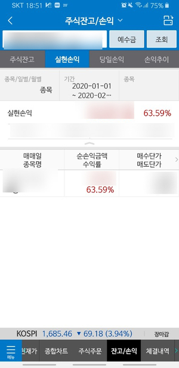
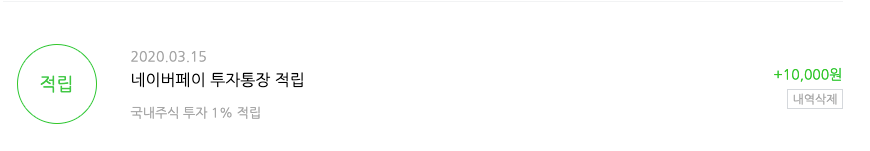

## 초보 주식투자 이야기

원래 펀드 투자만 하다가 좀 더 적극 적인 투자가 필요하다는 판단에 2020년 1월부터 시작한 주식 투자.

평소 주식에 관심을 갖고있던 지인들을 모아서 '주주클럽'이라는 동아리까지 만들곸ㅋㅋㅋㅋㅋㅋㅋ그들과 합심하여.....공부도 해가며 꾸준한 소액 투자를 실천하고있다.

믿어지진 않겠지만 1월 말에 산 어떤 주식이 하루 아침에 60%가 넘게 치솟았고ㅋㅋㅋㅋ얼떨결에 63%수익률을 보고 팔았다.

팔고나서야 내가 저 주식을 더 많이 샀었더라면....부질없는 후회를 했지만....인생은 선택이라고 했던가?........ㅋㅋㅋㅋ

그래도 첫 매수,매도 경험 치고 나쁘지않았던것으로 위안. 수익금은 당연히 다른 주식을 매수하는데 사용했다.

## 네이버페이 투자통장 적립

1. 아침에 눈뜨면 코스피 지수를 확인하게 됨 (feat.주식앱 실행)

원래 아침엔 인터넷 뉴스, SNS를 제일 먼저 들어갔는데 이제 그런건 뒷전된지 오래ㅋㅋㅋ지하철에서 주식앱 쳐다보던 아저씨들의 마음을 알게된 나...

2. 자동으로 사회경제에 관심을 가지게 됨

ㅋㅋㅋ이건 정말 이렇게 될 수 밖에 없다. 내 돈과 직결된 사회,경제 문제를 두눈똑바로 뜨고 지켜봐야 매수,매도 타이밍을 잡을 수 있다는 것...물론 아직도 모르는게 99%지만 1%라도 더 알게됐다는 점에서 의의를 둔다.

3. 새로운 세상에 눈을 뜨게됨

진정한 자본주의 사회의 시민이 된 기분이랄까?^^ㅋㅋㅋㅋㅋㅋㅋㅋㅋㅋㅋㅋㅋㅋㅋㅋㅋㅋㅋㅋㅋ자본주의 사회를 사는 사람이라면 주식 투자는 기본이라는 말이 있다. 단순히 일확천금을 노리는 투기,도박의 개념을 벗어나 가치있는 기업에 투자하면서 얻는 수익 창출 통로로 주식 투자는 나쁘지 않다는 생각 (아직 까지는)

물론, 나는 아직 직장인이기도 하고 전문 투자자가 아니라 하루종일 그래프를 들여다보고 팔았다, 샀다를 반복할 수 없기때문에 우량주 위주의 투자를 하고있기는 하지마는......

어쨌든, 주식 투자를 공부하면서 여기저기에서 지식을 얻고있는데...그 목록들을 공유해보려한다.

### 구독중인 뉴스레터

### 성선화 기자(친절한 성 기자의 재테크)

경제전문기자. 이미 유명한 사람이기도하지만, 제공하는 컨텐츠와 뉴스레터 퀄리티가 좋다. 투자에 초점을 맞춘 컨텐츠. 투자 초보자도 이해하기 쉬운게 큰 장점. 블로그에서 얻는 정보는 대부분 뉴스레터로 발송해주기때문에 뉴스레터만 신청해도 좋음. 나는 매일 아침 출근하면 뉴스레터를 보고 업무를 시작한다. ㅋㅋㅋ

[친절한 성 기자의 재테크](https://blog.naver.com/alloga)

#### UPPITY

사회초년생을 위한 경제 전문 미디어, 뉴스레터로 보내는 컨텐츠가 핵심. 사실 사회초년생에 초점이 맞춰져있다보니 나같은 사람한텐 그다지 유용하지 않은 정보도 많은 편인데 다양한 경제 카테고리를 다룬다는 점에서 추천할만하다. 사회초년생을 위하다보니 내용도 엄청 쉽게 되어있음. 사회초년생을 떠나서 금융문맹자라면 아주 좋은 뉴스레터가 될듯.

[UPPITY](https://uppity.co.kr/)

#### SNEK

경제 전문 미디어. UPPITY가 본격적으로 컨텐츠를 제작하여 뉴스레터를 보낸다면 SNEK은 제작 컨텐츠는 아니지만 주요 뉴스 꼭지를 기본으로 알아야한 경제 기사들을 스크랩하여 전달한다. SNEK이 좀 더 정보의 다양성이 있는 편. 다양한 기업 정보가 많아서 투자 종목을 찾는 사람에게 유용할 듯.
[SNEK](https://www.snek.ai/home#economy)

### 가끔 듣는 팟캐스트

10년이 넘은 나의 팟캐스트 사랑ㅋㅋㅋㅋㅋㅋㅋ팟캐스트없는 삶....상상도 못하죠?

팟캐스트로 정말 다양한 카테고리의 정보를 접하는데 요즘은 경제 카테고리를 자주 들어가본다. 여러개를 들어봤지만 아래 두개가 가장 듣기 편했기에 추천.

#### 경제의 신과 함께

유투브 채널도 운영하는데 나는 라디오를 좋아하므로 팟캐스트로. 어차피 경제 카테고리 1위 프로그램이라서 내가 설명하고 말고 할것도 없다 ㅋㅋㅋㅋㅋㅋ그냥 라디오 틀어놓듯 상시 틀어놓음

[경제의 신과 함께](http://www.podbbang.com/ch/15781)

#### 해요마요

유수진 언니가 진행하는 프로그램인데 짧게 방송하고 금방 종료함. 사회초년생, 금융문맹자를 위한 정보가 많아서 정말 스낵으로 즐기기 좋다.

[해요마요](http://www.podbbang.com/ch/16762)

### 재미있게 본 책

#### 만화 주식투자 무작정 따라하기

ㅋㅋㅋㅋㅋㅋㅋㅋㅋ주식 공부 시작하고 제일 처음 본 책. 어릴때 본 먼나라이웃나라 같은 책이라고 생각하면 쉽다. 쉽게 금방 읽기때문에 추천! 이것만 읽어도 주식투자 기본은 알게됨.

[만화 주식투자 무작정 따라하기](https://www.aladin.co.kr/shop/wproduct.aspx?ItemId=116048223)

그 외에도 다양한 책을 읽었다 말았다 하고있는데...아직 다 읽은게 별로 없어서 읽고 나면 추천해봐야겠다.

그럼 모두 부자되세요.....
