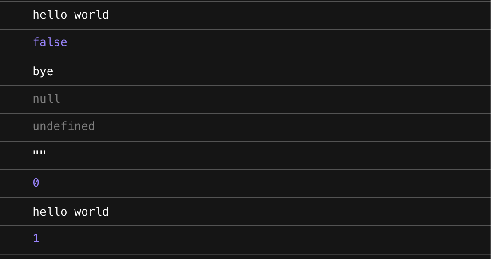
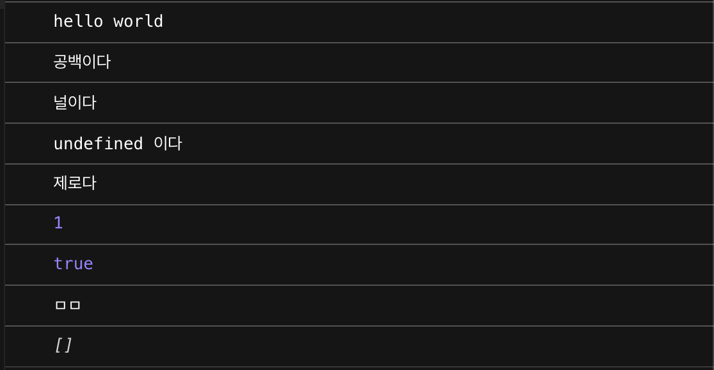

## 자바스크립트의 단축 논리 계산법

논리 AND연산자의 단축 계산법과 논리OR연산자에 대해서 정리 한다.

### 논리 AND연산자의 단축 계산법

```javascript
console.log(true && 'hello world')
console.log(false && 'hello world')
console.log('hello world' && 'bye')
console.log(null && 'hello world')
console.log(undefined && 'hello world')
console.log('' && 'hello world')
console.log(0 && 'hello world')
console.log(1 && 'hello world')
console.log(1 && 1)
```

결과는 아래와 같다.


- 논리 AND연산자는 첫 값이 true나 truthy이면 다음것의 값을 가짐
- 논리 AND연산자는 첫 값이 false나 falsy이면 값 비교 없이 첫 값을 false,falsy 값을 보낸다.

### 논리 OR연산자의 단축 계산법

```javascript
console.log(false || 'hello world')
console.log('' || '공백이다')
console.log(null || '널이다')
console.log(undefined || 'undefined 이다')
console.log(0 || '제로다')
console.log(1 || '1이다')
console.log(true || 'true다')
console.log('ㅁㅁ' || 'ㅇㅇ')
console.log([] || 'ㅇㅋ')
```

결과는 아래와 같다.


- 논리 OR연산자는 첫 값이 true나 truthy이면 바로 중단하고 true값
- 논리 OR연산자는 첫 값이 false나 falsy이면 다음 값을 보낸다.

#### 결론

많이 쓰이는 문법이며 정리가 필요 했던 문법이다.
