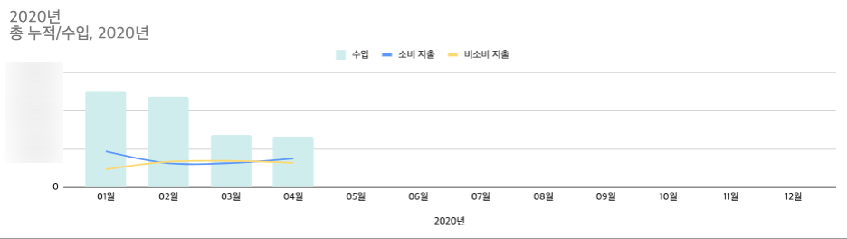
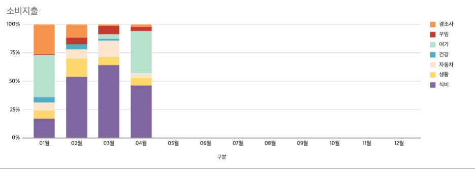
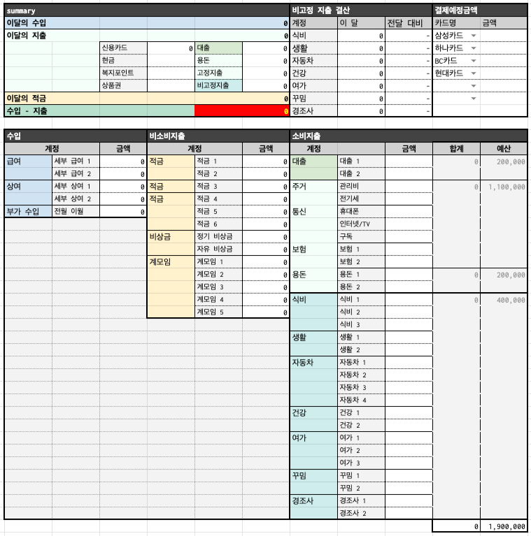
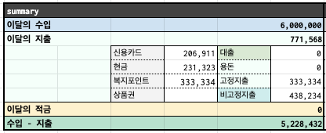
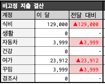
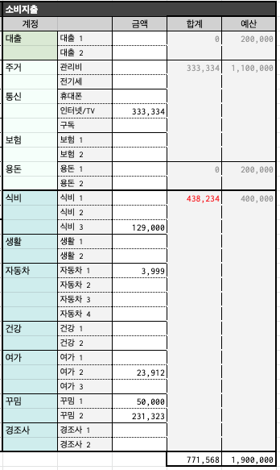

## 1/4분기 수입 대비 지출 결산 (신차 구입으로 인한 출혈)

1/4분기가 지나고 우리가 지난 4개월간 얼마나 써댔는지 결산을 해보았다.

​

1,2월 : 각자 성과급이 나오는 달이라 다른 달보다 수입이 2배. 하지만....비소비지출(적금)퍼센트가 낮은건 그 돈이 죄다 신차 구입으로 다 들어갔기때문이겠지요? 평소보다 많이 벌었어도 그만큼 쓴게 많아서 저축은 오히려 못했다. ㅋㅋㅋㅋㅋㅋㅋㅋ

3,4월 : 소비지출은 수입이 적든 많든 한결같다는 점...예산을 짜서 쓰기때문인지 그래프가 비교적 완만한 직선을 그리고있다.

비소비지출 그래프가 상승곡선을 타는것이 목표인데 4월엔 또 내려갔다.....진짜 안된다 흑흑흑흑ㅠㅠ

​

결론 : 신차 구입으로 출혈이 컸던 분기. 그럼에도 불구하고 수입의 50%는 반드시 저금하기를 지키긴 지켰다. (성과급 제외^,.^;;) 2/4분기는 노랑색은 상승, 파랑색은 하강을 만들어보자...

## 1/4분기 비고정 소비지출 결산(노는거 아니면 먹는거)

월급의 반의 반이 순수 소비지출인데...그걸 어디다가 썼는지 봤더니...

여가VS식비

ㅋㅋㅋㅋㅋㅋㅋㅋㅋㅋㅋㅋ

2,3월은 무슨 먹는거에 미쳐있었나?ㅋㅋㅋㅋㅋㅋㅋㅋㅋㅋㅋㅋㅋㅋㅋㅋㅋㅋㅋㅋㅋㅋ코로나19여파도 있고, 재택근무를 한달 넘게 해서 집에서 많이 해먹긴했는데....보라색만 높은거 왤케 웃기지^^...

우리 부부는 워낙 옷도 안사고 꾸미는거에 관심이 없어서 대부분 관심이 먹는거 아니면 여행이긴한데....그래프가 넘나 솔직해서 웃겼다.

1월은 상반기 여행 일정 세우고 항공권 결제하느라 여가 비율이 높았으나^^ 코로나19가 터질줄 누가 알았겠음? 결국 대부분 환불되긴했지만.....흑.......

2,3월은 여행 계획이 끝나서 돈쓸데가 없었는지 죄다 식비..식비..식비..진짜 웃긴건 우리는 또 배달은 잘 안한다 ㅋㅋㅋㅋㅋㅋㅋㅋ

집에서 해먹는게 겁나 많고 다양함.

그래서 이번달은 3월의 식비를 반성하고자 먹는걸 줄여보려노력했지만....다른걸 줄이면 다른데서 터지는게...인생인가?..

여행을 못가니까 별의별걸 다 사들이면서 예산이 터지는것으로 4월을 마무리ㅋㅋㅋㅋㅋ

​

결론 : 코로나19로 인한 재택근무로 식비 고공행진 중. 2/4분기에는 조금 덜 먹어보자....

### 결국 다시 만든 나만의 가계부(집착의 결과)

약 3개월간 가계부를 쓰면서 정말 나에게 필요한 데이터가 뭔지 깨닫게되었다. 가계부의 목적이 분명해졌다고 해야하나?

그래서 내가 원하는 데이터를 따로 보기에 그 전 가계부는 적합하지 않아서 결국 가계부를 새로 만들기에 이르렀다. (ㅋㅋㅋㅋㅋ)

​

남편이 엑셀 전문가라서 ㅋㅋㅋㅋㅋ 내가 어떻게 하고싶다라고 말하면 남편이 만들어주는 방식으로 작업,

물론 퇴근하고 집에와서 남편이랑 정리하다보니 시간이 더 걸리기도했지만, 머리속에 엉켜있는 그림을 엑셀로 정리하기는 생각보다 쉽지 않았다.

필요한 정보와 구분 방식을 새로 정리하고, 거기에 맞는 포멧을 짜기까지 대략 한달의 시간이 걸린듯...

​

내가 그전 포스팅에서 작성했던 자산현황 데이터는 그대로 유지하고 월별 지출내역표만 새롭게 업데이트하였는데...

내가 가계부에서 정말 보고싶었고, 중요하다고 생각한건 크게 세가지였다.

### 1. 총 수입-지출=잔액

월별 지출내역표의 결산 영역. 한눈에 이번달 수입, 지출, 지출의 세부 계정을 확인하는 영역을 만들었다.

우리는 지출 방식이 신용카드아니면 현금, 복지포인트뿐이라서 체크카드는 아예 만들지 않았다.

수입-지출이 마이너스일 경우 해당 셀은 빨강색으로 표기되게했다^^ ㅋㅋㅋㅋㅋㅋㅋㅋㅋㅋ

### 2.전달 대비 지출 금액

고정지출은 줄일 수 없기도하고, 매달 고정금액이라 전달 지출과 비교할 필요가 없으나 비고정 지출은 전달과 비교할 필요가 있다고 느꼈다.

1월만해도 비고정지출의 세부 예산을 책정했으나 돈을 쓰다보니 그게 의미 없다고 여겨졌다. 그래서 비고정 지출의 큰 예산만 정해놓는것으로 변경.

살아보니..역시 비고정지출 계정마다 지출하는 금액이 매달 천차만별이었다.

그래서 전달대비 이달에 사용한 금액을 확인하고 싶어서 추가한 영역.

### 3.예산 대비 현재 지출 상황

3개월동안 가계부를 쓰며 항상 주시했던 부분은 지금 우리가 예산의 얼만큼을 사용했는지였다.

그래서 그걸 바로 볼 수 있도록 만들었다.

정해진 예산을 넘게 사용하면 해당 셀의 글씨가 빨강색으로 바뀌했다 ㅋㅋㅋㅋㅋㅋㅋㅋㅋㅋㅋㅋㅋㅋㅋ 하지만 빨강색으로 바뀌든 말든...쓸건 쓴다는게 문제...^^앞서 말했듯 나는 비고정지출은 예산을 하나로 잡고 그 안의 세부지출은 별도 예산을 책정하지 않는것으로 예산 방식을 변경했다.그래서 대출, 고정, 비고정지출로 예산을 크게 나눠서 확인 중.

3개월 넘게 가계부를 쓰다보니 우리가 매달 어떤 부분에서 어느정도 쓰고있는지 대충 감이 잡히긴하지만 예산 책정에 대한 부분은 조금더 데이터가 필요한 영역.

아직도 비고정 지출 예산이 늘 부족하다 ㅠㅠㅠ

#### 1/4분기 결산(아껴쓰는것이 답)

아직 4월이 끝나지 않았지만 굵직한 지출은 끝났기에 조금 빨리 결산을 해본다.

30년 넘에 혼자 돈을 써오다가 한 가정의 경제생활을(?)책임지는 역할을 하다보니 돈관리에 대한 고민이 깊은 시기였다.

선 적금 후 지출 방식을 사용하는것이 맞고 앞으로도 그렇게 할 예정이지만, 지난 4개월간 지출을 줄이지 못하다보니 예산이 부족한 경우가 무척 많았다. 예산이 부족할 경우 예비비나 비상금에서 사용하다보니 비상금은 늘 제자리 걸음 ㅋㅋㅋㅋㅋㅋㅋㅋ^^

​

우리가 계획한 예산이 정말 맞는것인지 다시 점검해볼 필요가 있다고 느꼈고,

효율적으로 지출을 관리하는 것이 정말 중요한 과제라는 생각이 들었다 ㅠㅠ 물론 아직 그 방법은 찾지 못했고요.....

아무리 수입을 늘려도 지출을 통제하지못하면 말짱 도루묵이라는것을 알기에..

#### 2/4분기 목표(부수입을 만들자)

1. 예산 다시 점검

아직도 풀지 못한 숙제지만ㅋㅋㅋㅋㅋㅋㅋ비고정지출 예산을 늘리면 비소비지출(적금) 예산을 줄일수밖에 없는 상황이라 이게 맞는지 모르겠다. 지출을 줄이는게 답인데 그게 되지 않고있으니..

​

2. 비고정 지출 줄여보기

우리가 가장 많이 사용하는 식비, 여가의 지출을 줄여보겠다^^ 하지만 줄여지지 않다는게 문제?ㅋㅋㅋㅋㅋㅋㅋㅋㅋㅋㅋㅋㅋㅋㅋㅋ이건 남편이랑 얘기를 해보고 방법을 연구해볼 생각. 답이 나올랑가모르겠지만....

​

3. 부수입 늘리기

나는 우리 가계 예산에는 회사에서 주는 돈 외에 생긴 부수입을 별도로 책정하지 않는다. 부수입은 말그래도 부수입이지.... 그걸 가계 수입으로 넣으면 돈이 많은 줄 착각하고 ㅋㅋㅋㅋ 돈을 더 쓰기때문에^^ 그래서 중고거래, 투자수익 등의 부수입은 개인이 알아서 재투자를 하거나, 별도로 모아두기만 하고있다.1분기에 개인의 부수입으로 소액 투자를 실천하면서 꽤 많은 공부를 한것으로 만족. 2분기에는 실질적인 부수입을 통한 재투자로 투자수익을 얻는것을 목표로 하려한다.

​

돈을 많이 쓴 달이면 정말 가계부가 쓰기 싫다 ㅋㅋ

그럼에도불구하고 열심히 써야한다.

가진거 없이 시작한 우리 부부가 자산가가 되기 위해서는......

조금 덜 쓰고 조금 더 많이 모으는 것이 답.

​

열심히 살자!

​

​

​

1/4분기 결산 끝.
