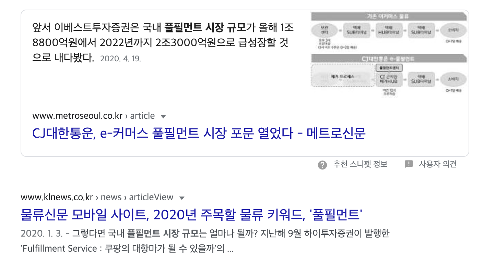
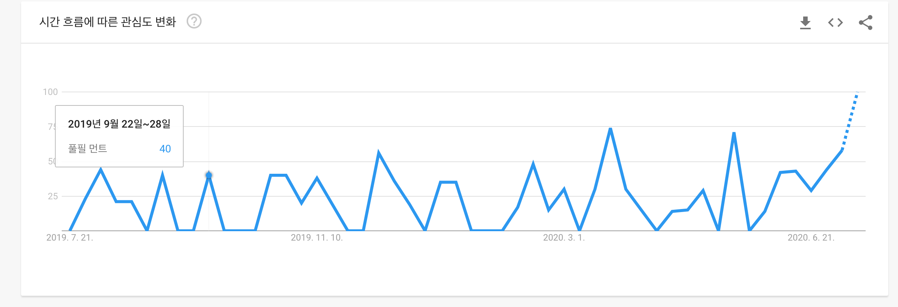

# 최근에 공부한 금융

최근에 알고 공부하게 된 단어(용어)들은 아래와 같다.

- 물류기업형태 - 1PL,2PL,3PL,4PL,5PL,Fullfillment Service(풀필 먼트)
- PER
- PBR

## PER, PBR 어떻게 이해해야 하는가?

- PER(Price Earning Ratio)
  주가/주당순이익(EPS)인데 그냥 간단하게 말하면 현재 그 기업의 주가가 10만원이면 PER 3이면 10만원 기준으로 3년이면 해당 순이익을 벌수 있다고 생각하면 된다. 보통 낮으면 좋은거라고 생각하면 된다고 함.

- PBR(Price to Book Ratio)
  주가 순자산 비율. 주가가 주당 순자산의 몇배로 매매 되고 있는것인가. 낮으면 좋다. 보통 1부근이면 저평가로 평가 받았다고 생각한다.

## 물류기업형태(1PL,2PL,3PL,4PL,5PL)

- 1PL (First Party Logistics)
  회사에서 발생한 물류 업무를 자사 내부적으로 수행하는 개념의 물류서비스. 이 경우에는 외부 업체에 의탁하여 서비스를 받는 과정 없이 사내 부서를 통해 자체적으로 물류 업무를 해결한다.

- 2PL (Second Party Logistics)
  회사에서 발생한 물류 업무를 별도로 독립시킨 자회사 또는 계열사를 통해 수행하는 경우의 물류서비스를 말한다. 이 경우에는 기존에 사내에서 물류 업무를 담당하던 부서가 독립하여 자회사가 된 경우가 일반적이며 자회사를 둘 정도로 규모가 큰 대기업들이 채택하기 좋은 방식의 물류서비스이다.
  2PL은 자회사 물류 서비스가 아니라, 운송수단을 소유하고 있는 업체가 소유하고 있는 배, 트럭, 항공 등을 이용하여 서비스를 제공하는 것이다. 즉, Carrier 업체를 말합니다.

- 3PL (Third Party Logistics)
  회사에서 발생한 물류업무를 외부 물류 전문 업체에게 아웃소싱하여 물류 서비스를 제공받는 것을 의미한다. 원래 3PL은 외주물류라는 개념에서 부터 출발하였지만 외주물류가 물류업무의 외부업체로의 이전을 통한 원가절감에 초점을 맞추는데에 반해 3PL은 원가 절감 뿐만이 아닌 장기적 협력관계 구성, 넓은 범위의 종합 서비스 제공 등의 더 전략적이고 고차원적인 효과까지도 창출할 수 있다는 점에서 외주물류보다 더욱 발전된 개념의 서비스를 말한다.

- 4PL (Fourth Party Logistics)
  기존의 3PL에 IT와 컨설팅 분야까지도 포함한 통합 솔루션을 제공하는 물류 서비스로서 3PL보다 한 단계 더 발전된 개념. 4PL은 10년 정도의 장기계약이나 합작기업으로 설립된 별도의 조직을 통해 포괄적인 SCM을 제공하기 위하여 여러 부문의 서비스 제공자들과 주간조직의 자원, 능력 및 기술을 조합하고 관리하는 통합시스템으로 정의된다. 이는 전문화된 현대사회에 맞춰 물류서비스가 더 이상 수송, 보관, 하역, 포장 등의 물리적 업무에만 국한되지 않고 최신 정보통신 기술을 접목한 서비스의 제공과 광범위한 공급 사슬 조직의 관리를 위한 컨설팅 서비스의 제공 등을 포함하는 개념으로 발전된 결과이다.

## Fullfillment Service(풀필 먼트)

- 풀필 먼트 서비스(Full Fillment Service)
  ‘풀필먼트란 무엇인가. 쉽게 말해 물류센터에 상품이 입고, 보관, 출고되기까지의 과정을 관리하는 과정이라고 볼 수 있다. 국내에서 사용하는 비슷한 용어로 3PL(Third Parties Logistics)이 있는데, 그 용례는 조금 다르다. 3PL이 ‘오프라인’과 ‘B2B물류’ 운영에 초점이 맞춰져 있다면, 풀필먼트는 ‘온라인’과 ‘B2C물류’ 운영에 그 방점이 찍혀있다.’ – 바이라인네트워크 엄지용 기자
- 구글 트렌드 풀필먼트 (https://trends.google.co.kr/trends/explore?geo=KR&q=%ED%92%80%ED%95%84%20%EB%A8%BC%ED%8A%B8)
- 관련 검색어(네이버 풀필먼트, 쿠팡 풀필먼트, 카카오 풀필먼트, 풀필먼트 시장규모)
  
  
- 유진증권 레포트(https://www.eugenefn.com/comm/msgList.do) 검색어 "풀필먼트" 로 검색하면 07.08일 레포트가 있다.

### 네이버 풀필먼트

[네이버 풀필먼트 관련 검색시](https://www.google.com/search?q=%EB%84%A4%EC%9D%B4%EB%B2%84+%ED%92%80%ED%95%84%EB%A8%BC%ED%8A%B8&oq=%EB%84%A4%EC%9D%B4%EB%B2%84+%ED%92%80%ED%95%84&aqs=chrome.1.69i57j0l3j69i60l3.2715j0j4&sourceid=chrome&ie=UTF-8) 많은 내용의 글들이 있다.

네이버의 풀필먼트 투자가 계속되고 있다. 지난 3월부터 시작해서 벌써 네 번째다. 발표 순서대로 치면 3월 16일 위킵, 3월 20일 두손컴퍼니, 3월 27일 신상마켓, 5월 4일 FSS(에프에스에스) 순이다. 사실 FSS도 투자가 확정된 것은 3월 중순이라고 하니 순서는 큰 의미가 없다. 실질적으로 동시 다발적으로 여러 업체가 한데 묶여 투자가 진행됐다고 보는 것이 맞다. 이 외에도 네이버는 CJ대한통운 풀필먼트 서비스를 통해 LG생활건강 네이버 브랜드스토어 판매 물류를 연동하는 등 ‘연결’을 중심으로 자사 이커머스 물류를 고도화하는 움직임이 관측된다. - byline network

### 쿠팡 풀필먼트

쿠팡은 2016년부터 풀필먼트 서비스 가동을 준비해왔으며, 2020년 초반에 인력을 대거 채용하고 있다.
[채용정보](<http://www.saramin.co.kr/zf_user/company-info/view/csn/8378700664/company_nm/%EC%BF%A0%ED%8C%A1%ED%92%80%ED%95%84%EB%A8%BC%ED%8A%B8%EC%84%9C%EB%B9%84%EC%8A%A4(%EC%9C%A0)>)
[쿠팡, ‘상장 열쇠’ 풀필먼트서비스 개시 속도내나 - 관련 기사](https://www.thebell.co.kr/free/Content/ArticleView.asp?key=202001281221164320104010)

### 카카오 풀필먼트

[카카오 풀필먼트 구글검색시](https://www.google.com/search?q=%EC%B9%B4%EC%B9%B4%EC%98%A4+%ED%92%80%ED%95%84%EB%A8%BC%ED%8A%B8&oq=%EC%B9%B4%EC%B9%B4%EC%98%A4+%ED%92%80&aqs=chrome.1.69i57j0l7.2543j0j4&sourceid=chrome&ie=UTF-8)
카카오는 IT 플랫폼을 중심으로 분절된 여러 물류업체들의 연결점을 만드는 방식으로 풀필먼트 사업을 구상하고 있다. 물류센터 입고(Inbound)부터 출고(Outbound)까지 현장 오퍼레이션 요소요소에는 카카오가 보유한 IT 기술들이 적용될 계획라고 한다.

[자세한 내용은 기사 참고](https://byline.network/2020/03/19-100/)

#### 참고 자료

- [wiki](https://ko.wikipedia.org/wiki/%EB%AC%BC%EB%A5%98_%EC%84%9C%EB%B9%84%EC%8A%A4)
- [플필먼트 서비스(Fullfillment Service) 정의, 역사, 장점 그리고 아마존(FBA)과 국내 현황](https://joyfulnakawon.tistory.com/m/256)
- [byline network기사](https://byline.network/2020/05/04-27/)
- [byline network기사](https://byline.network/2020/03/19-100/)
