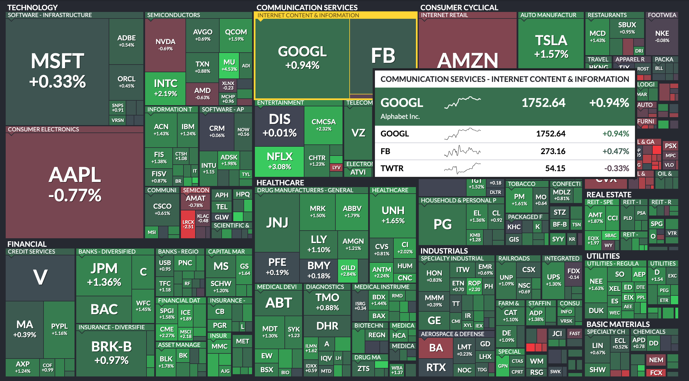
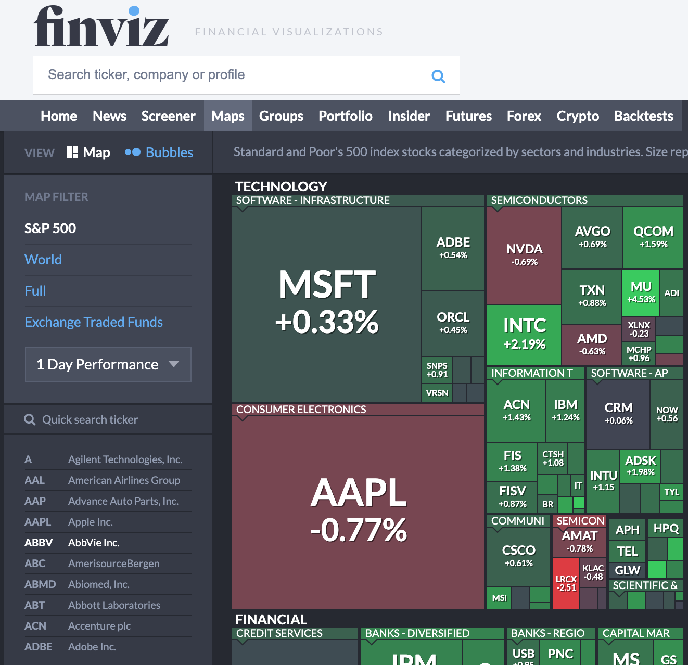

# 2021년은 미국 주식을 하자
2021년에는 적은 돈이지만 한국 주식에서 미국 주식으로 전환하고자 한다. 제대로 미국 주식 하기 전에 공부하기 위해 아니면 필요한  알아야하는 사이트는 어떤게 있는지 평소에 보던 사이트랑 다른 사이트도 알아보고 정리하고자 한다.

- FINVIZ
- MARKETWATCH
- FINANCE-YAHOO
- SEEKINGALPHA
- ETF.COM
- TIPRANKS

그 중 제일 처음으로 FINVIZ 사이트에 대해서 정리 하고자 한다.

## 1. FINVIZ 사이트

보통 이사이트는 MAP을 보기 위해 들어간다.

[FINVIZ MAP](https://finviz.com/map.ashx) 링크 클릭해서 들어가면 주가의 움직임을 한번에 보기좋다.

S&P500 지수의 기업 지도이고 그 날 기업의 주가가 상승했는지 하락했는지 보합인지 쉽게 색으로 구분할 수 있다.
섹터별로 나뉘어져 있어 섹터 자체의 하락, 상승 여부, 그리고 사각형의 크기로 그 기업의 시총을 예측 할 수 있다.

상단 메뉴 MAPS를 클릭하고 왼쪽 메뉴 셀렉트 메뉴에서 원하는 옵션을 선택해서 보면 비교하기 쉽게 만들었다.

주로 아침에 일어나서 얼마나 변화가 있었는지 체크를 한다.

또   [Screener 메뉴](https://finviz.com/screener.ashx) 에 들어가서 옵션에 맞게 검색해보고 보는 방법도 있는데 나는 아직까지는 주린이여서 그런지 안쓴다.

