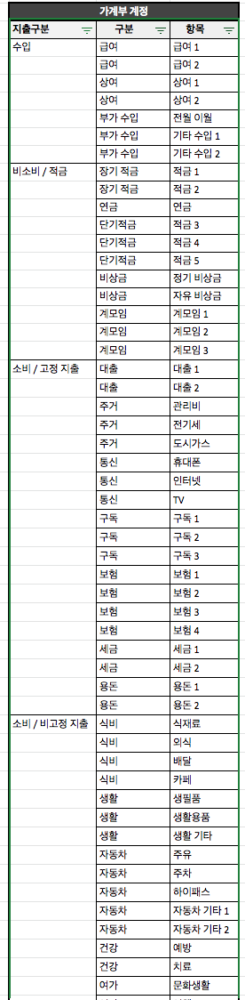
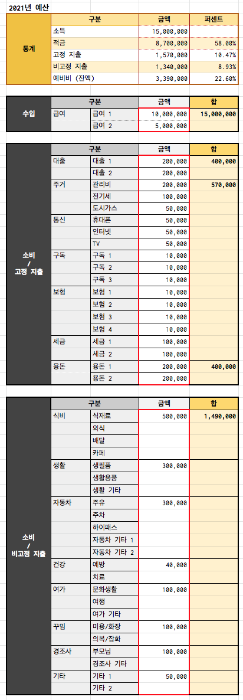
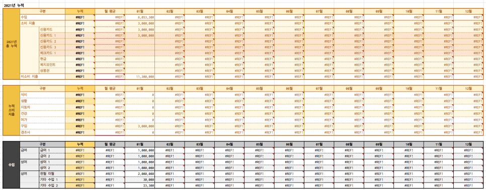
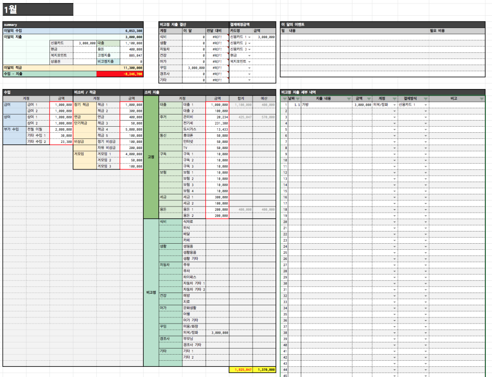
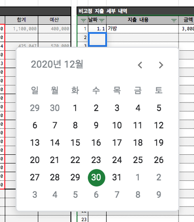
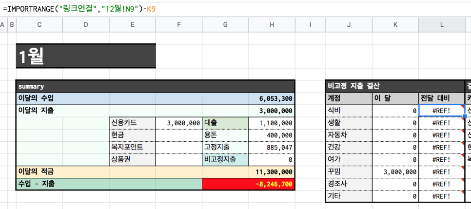
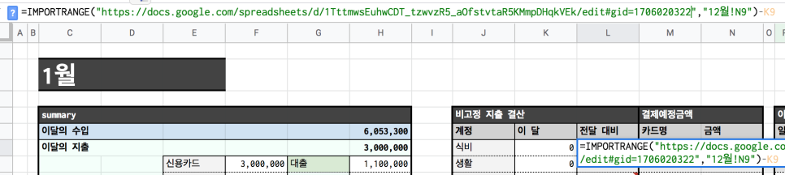
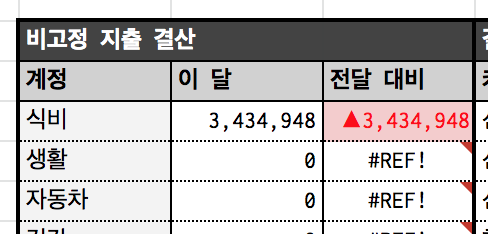

죽지않고 살아 돌아온 2021년 가계부 양식 입니다.

2020년 가계부와 사용하는 방법은 동일합니다. 

## 1. 가계부 양식 다운로드 링크

1. 가계부는 구글 스프레드 시트로만 공유합니다.

2. '사본'으로 복사하거나 or 엑셀 파일로 '다운로드'해서 사용하세요. (어떻게 하는지 모르면 검색하세요.)

3. 본 링크의 편집 권한은 드리지 않습니다. (이메일로 원본 파일 권한 요청하는 사람이 오천명정도있었는데 그런 메일 올때마다 바로 삭제하는 편)

4. 본인의 가계 상황에 맞게 알아서 편집해서 사용하세요.  (본인이 다운로드한 파일의 편집은 자유)

https://docs.google.com/spreadsheets/d/1rHQhqTSVIwAN9I9lNtz3dKUYdK6ocCOFiPRrDUQatSM/edit?usp=sharing

## 2. 가계부 사용법

2020년 가계부와 기본 양식은 모두 동일합니다만, 

제가 1년동안 가계부를 쓰면서 수정이 필요하다고 느낀 부분과 다른 분들의 의견을 수렴하여 조금 수정해보았습니다. 

​

### A. 계정

수입, 지출 분류 항목을 작성하는 페이지입니다. 

가계부 계정, 금융 계정을 씁니다.

본 페이지 항목이 다른 페이지의 분류 항목으로 자동 입력되므로 내용을 정확하게 써주세요. 

​

### 1. 가계부 계정 

본인의 가정 상황에 맞게 분류와 구분을 나눠서 쓰면되는데, 항목이 많으면 삭제를 하시고, 적으면 늘리면됩니다. 

2020년엔 계정을 코드로 분류해서 썼는데...쓰더보니 굳이 코드로 할 필요가있나?라는 생각이 들었어요 ㅋㅋㅋ 어차피 가계부 계정이라는게 처음에 한번 쓰고나면 수정을 안하다보니......그래서 코드는 없애버리고 단순하게 변경했습니다. 

​

1) 수입

2) 비소비 적금

3) 소비 고정 지출

4) 소비 비고정 지출

### B. 2021년 예산

빨간 테두리 부분만 입력하면 나머지는 자동 계산됩니다. 

소비 고정지출의 합 부분은 저는 대출, 고정 지출, 용돈을 나눠서 보기위해서 저렇게 분류한것이고....원하는 대로 수정하시면될거같아요.

통계에서 적금과 모든 지출의 예산을 짜고난 뒤 남은 예비비 부분도 추가되었습니다. 

### C. 메인 (현금흐름표)

현금 흐름표는 2020년과 마찬가지로 월별 지출페이지를 입력하면 자동으로 계산되어 들어갑니다.

따로 입력할 내용은 없습니다. 

변경된 부분은 아래와 같습니다.

​

1) 총 누적 항목 - 소비지출에 지출 별 항목을 추가

2) 월 평균 항목 추가 

​

카드 별 사용금액을 볼 수 있도록 항목을 추가했기때문에 금융계정에 작성한 카드 항목대로 사용한 금액이 취합될거에요. 

그리고 예산을 쉽게 짜기위해서 월 평균 항목도 추가했습니다.

현재 스프레드 시트는 1,2월 페이지만 있기때문에 3월 ~ 12월 페이지는 수식 오류로 뜹니다. 직접 페이지를 추가해서 사용하세요. 

### D. 월별 지출표

쓰는 방법은 모두 동일합니다. 

앞서 작성한 계정, 예산 항목을 제대로 썼다면 모두 자동으로 입력되어 있기때문에 지출 금액만 쓰면됩니다. 

빨간 테두리의 항목은 대부분 고정적인 내용으로 해당 영역에 직접 금액을 작성하고, 

비고정 지출은 비고정 지출 세부 내역 영역에 지출 내용을 입력하면 자동으로 표기됩니다. 

세부 지출 내역 날짜 항목을 더블 클릭하시면 캘린더 팝업이 뜹니다. 날짜를 더 편하게 입력하세요! ㅋㅋ 

#### +2020년 12월 항목과 전달대비 항목 연동하기
​

1) 제가 수식은 이미 입력해놓았습니다.

2) 전달 대비 영역을 선택합니다. 

3)함수를 입력하는 영역에 "링크연결" 이라는 텍스트가 보입니다. 

4) "링크입력" 텍스트를 지우고 본인의 2020년 12월 탭의 URL을 입력합니다. 

5) 제대로 입력을 했다면 전달대비 항목이 노출됩니다.

#### +계정 분류 항목 추가하기

사실 이 부분은..자세하게 설명하기가 좀 애매한데요. 엑셀 함수를 아신다면 다른 수식을 보고 알아서 추가해서 사용하실 수 있을거라 생각합니다. 일단 계정 페이지에서 항목을 추가 한 뒤, 2021년 예산 > 메인 > 월별 지출표 순으로 모두 추가한 계정 항목을 하나씩 추가하면서 수식을 수정하시면됩니다. 어렵다기보다 노가다를 해야하기때문에 월별 지출표를 1,2월이 있는 상태에서 모두 수정하신 뒤에 나머지 페이지를 추가하는게 편할거에요! 

​

#### +그 외

1) 사람이 만들었기때문에 수식, 함수 오류 당연히 있을 수 있습니다. 알아서 수정하거나 제보해주세요.

2) 본인이 만든것처럼 재배포만 하지마세요.

3) 기본 함수와 엑셀을 안다면 정말 쉽게 수정해서 쓸 수 있습니다...모르는건 네이버 신공을!!! 

4) 그럼 모두 잘 사용하세요!

​
2020년 문파이 가계부

https://blog.naver.com/jovely55/221956773901

[출처] 2021년 가계부 양식 공유 (구글 스프레드시트 버전)|작성자 문파이

