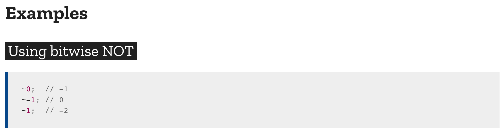

## javascript indexOf 구문 설명

배열에서 지정된 요소를 찾을 때 indexOf를 사용한다.
메서드는 배열에서 지정된 요소를 찾을 수 있는 첫 번째 인덱스를 반환하고 존재하지 않으면 -1을 반환합니다.

구문

> ```javascript
> arr.indexOf(searchElement[, fromIndex])
> ```

### 매개변수

#### searchValue
찾으려는 문자열. 아무 값도 주어지지 않으면 문자열 "undefined"를 찾으려는 문자열로 사용합니다.

#### fromIndex(Optional)
문자열에서 찾기 시작하는 위치를 나타내는 인덱스 값입니다. 어떤 정수값이라도 가능합니다. 기본값은 0이며, 문자열 전체를 대상으로 찾게 됩니다. 만약 fromIndex 값이 음의 정수이면 전체 문자열을 찾게 됩니다. 만약 fromIndex >= str.length 이면, 검색하지 않고 바로 -1을 반환합니다. searchValue가 공백 문자열이 아니라면, str.length를 반환합니다.

### 반환 값
searchValue의 첫 번째 등장 인덱스. 찾을 수 없으면 -1.


### javascript indexOf 사용시 Tip

방법은 아래와 방식처럼 사용하면 약간의 팁이 된다.

```javascript
var arr = [ 1, 2, 3, 'foo' ];

// old way
if (arr.indexOf('foo') > -1) {
    console.log('"foo" is in "arr"!');
}


// new way
if (~arr.indexOf('foo')) {
    console.log('"foo" is in "arr"!');
}
```

방법은 비트 연산자의 ~(The Bitwise NOT-Operator)을 이용한 방법이다.

```javascript
// ~N -> -(N+1)
```

[관련 MDN 문서] : https://developer.mozilla.org/en-US/docs/Web/JavaScript/Reference/Operators/Bitwise_NOT




### ES6 이후 방법(includes를 사용)

```
var arr = [ 1, 2, 3, 'foo' ];

console.log(arr.includes("foo")); // true
console.log(arr.includes("4")); // false
```


