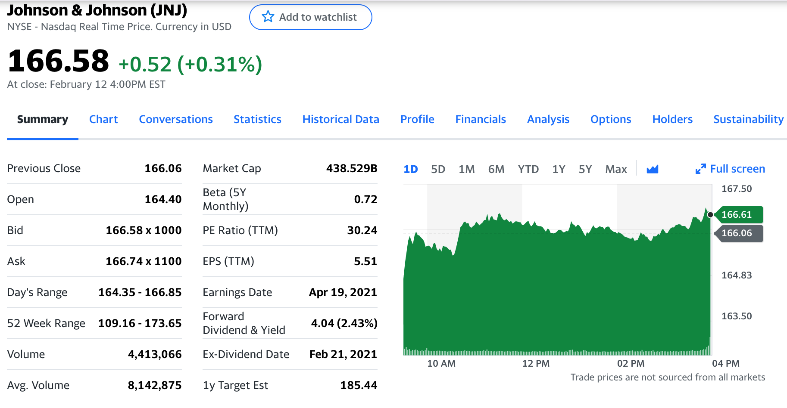
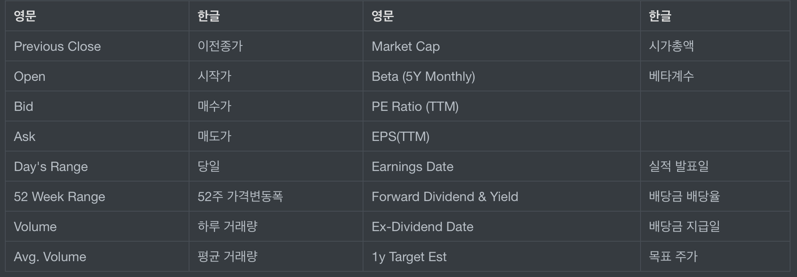
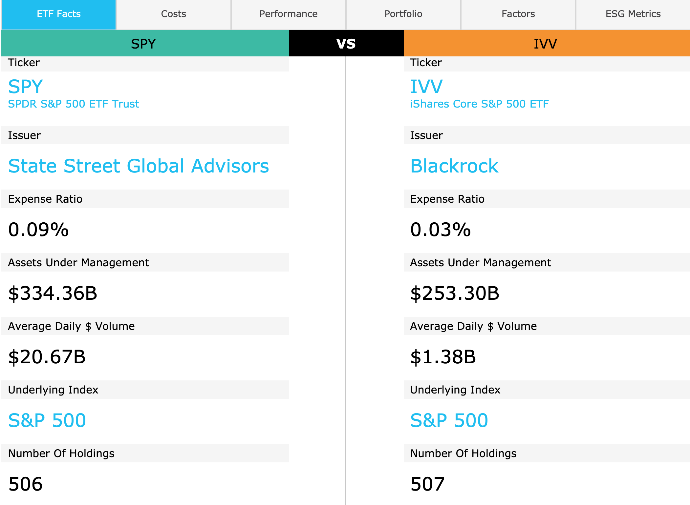

# 미국주식영어단어
미국 주식을 하다 보면 기본적으로 많이 들어가는 사이트들이 있다. 들어가서 많이 보는 단어를 체크 해서 기억하고자 한다.

## Yahoo-Finance에서 찾아본 영어

야후 사이트에 들어가서 종목을 클릭하고서 봤을때 나오는 단어 들이다.

- Previous Close: 이전종가
- Market Cap: 시가총액
- Open: 시작가
- Beta (5Y Monthly): 베타계수
- Bid: 매수가
- PE Ratio:
- Ask: 매도가
- EPS(TTM):
- Day's Range: 당일 거래 금액 범위
- Earnings Date: 실적 발표일
- 52 Week Range: 52주 가격변동폭
- Forward Dividend & Yield: 배당금 배당율
- Volume: 하루 거래량
- Ex-Dividend Date: 배당금 지급일
- Avg. Volume: 평균 거래량
- 1y Target Est: 목표 주가

- 베타계수 : 베타계수는 주식시장에서 **어떤 종목이 시장의 평균적인 움직임 대비해서 얼마나 민감하게 움직이는지를 수치로 표현한 값**을 의미합니다.

  ​				공격적 성향의 투자자들은 **베타 계수**가 높은 종목을 선호하는 경향이 강하다.

- TTM은 Trailing Twelve Month라고 해서 파이낸스에서 사용되는 단어인데, 연초 연말 결산 기준이 아니고 최근 12개월 동안의 결과라는 뜻을 가지고 있습니다.

## ETF.COM에서 찾아본 용어

- Ticker: 종목코드
- Issuer: 운용사
- Expense ratio: 운용보수
- Assets under management: 운용 자산 규모
- Average volume: 평균 거래 대금
- Underlying index: 추종하는 벤치마크
- Number of holdings: 구성 종목의 개수

관련 자료: 

[ETF - 비교사이트]: https://www.etf.com/
[베타계수 - 동아일보]: https://www.donga.com/news/Economy/article/all/20080430/8572842/1
[TTM - 나숫불]: https://nasutbul.tistory.com/259

 